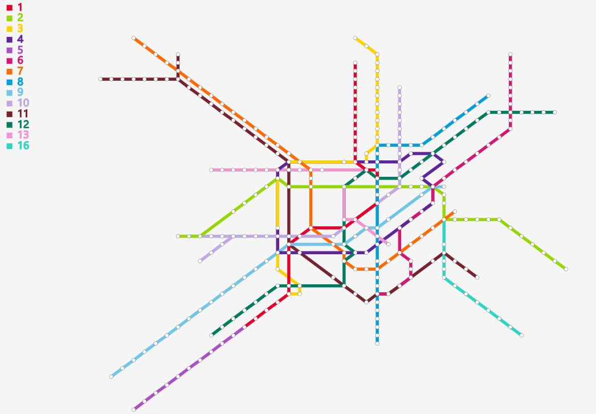

# Metro-Wordle
Metro+Wordle Visualization and Layout
----
### 简介
#### 地铁线自动布局   
  我们常比较容易获得的是地铁站点的地理信息和连接关系，而人们普遍接受的整齐美观线路图常由制图人员手工完成。这里使用MIP等算法，自动生成美观的地铁线路图布局。
  如下图所示：
   origin   
  
   after    
  
  （该步骤目前使用Python编写，在后端完成，与数据格式有关，暂不上传源码)
#### Word Cloud生成
#### Word Cloud嵌入
   

### 使用
### 算法
