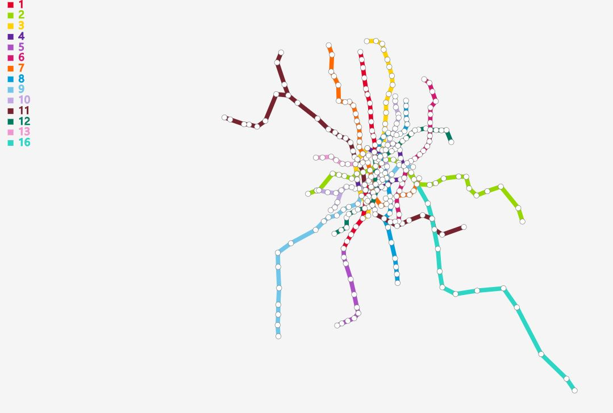
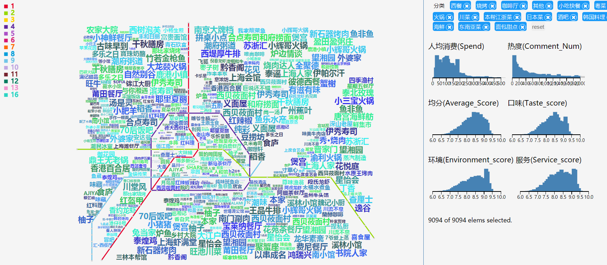

# Metro-Wordle

Metro Layout and Wordle Embedding   
[点此访问demo](https://chenluli.github.io/Metro-Wordle/metro/demo.html)

----
### 简介
 1 .处理地铁线路数据，自动生成地铁图。   
 2. 通过百度API获取地铁站点附近信息，生成文字云，并布局在地铁线路图中。

#### 地铁线自动布局   
 我们常比较容易获得的数据是地铁站点的地理信息和连接关系，而易于人们理解的地铁线路图通常布局整齐美观，目前常由专业制图人员手工完成。这里使用MIP等算法，自动生成美观的地铁线路图布局。
  如下图所示：  
  原地铁图：   
        
  优化后的地铁线路图：   
      
  
  （该步骤目前使用Python编写，在后端完成，与数据格式有关，暂不上传源码)
  
#### 站点文字云
默认状态下，图中显示换乘站的文字云信息。用户点击站点，该站点将新增文字云，词汇信息由百度API获取，若已有文字云占据了新增文字云空间，该文字云会消失，若想保留该站点文字云，可按住ctrl键。
示例效果：

#### 区域文字云
地铁线将图划分了不同区域，从区域中选取若干地点，获取相关信息，用相关文字填充该区域。
示例效果如下：   
    
   
（生成速度较慢，效率尚未优化，需等待）

### 算法
地铁线路布局参考论文：  
[1]Drawing and labeling Metro Maps  
[2]Heuristic network topology layout algorithm based on properties of nodes
wordle布局参考：
[1]InfoVis2010 ManiWordle [Kyle Koh]
[2]Tag Cloud++ - Scalable Tag Clouds for Arbitrary Layouts
区域文字云：
（待补充）
### 使用
